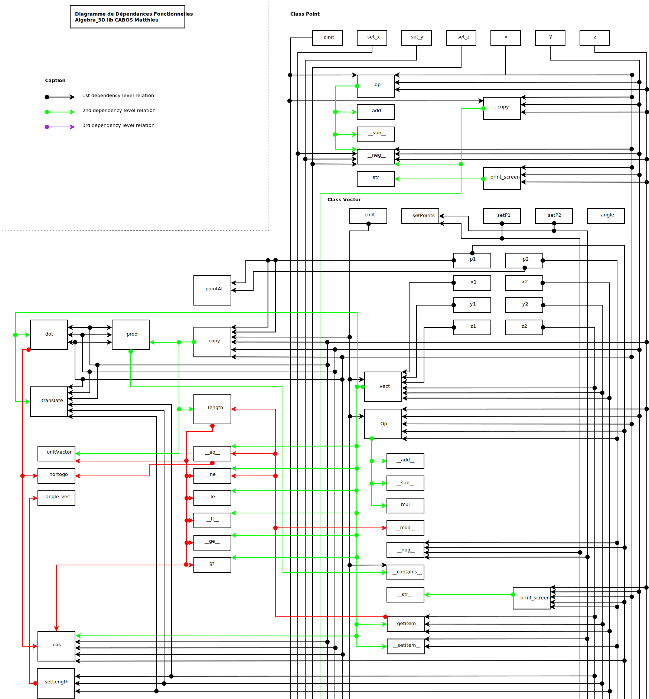

.. Vectorial_Library documentation master file, created by
   sphinx-quickstart on Thu Jul 16 13:30:42 2020.
   You can adapt this file completely to your liking, but it should at least
   contain the root `toctree` directive.

Welcome to Vectorial_Library's documentation!
=============================================

Here is my new version of the Vectorial library.

This library is an optimized vectorial computation api.
Made with Cython, it works as fastest as a standard C++ or C librairy.
This module have been splitted into 2 main parts :

	* **The Point Object** : It allows to manipulate Point Object into a 3 Dimension environnement.	The main operators have been implemented. This object are compatible with the following Vector Class. The avaible methods are listed as follow :

		* **copy** : Clone the current object
		* **op** : Operator facrtorization code implementing all standard operator (+,-, ...)
		* **print_screen** : Standard terminal scrren printer
		* **Getters and Setters**

	* **The Vector Object** : It permit to manipulate Vector Objects into a 3 dimensions environnement.	This class use Point as parameters, many of these methods are the "well known" vector standard manipulation operators. The avaible methods are listed as follow :

		* **angle** Get the alpha angle between vector and norm.
		* **angle_vec** Get the alpha angle between two vectors
		* **copy** Get a clone of the current object
		* **cos** Get a cosinus from two vector's angle
		* **dot** Compute standard dot between two vectors
		* **hortogo** Assert hortogonality of two vectors
		* **length** Get the vector's **real** length
		* **op** Operator facrtorization code implementing all standard operator (+,-,*, ...)
		* **pointAt** Compute the translation from given Point and Vector
		* **print_screen** Standard terminal scrren printer
		* **prod** Compute standard cross product between two vectors
		* **setLength** Set the vector's **real** length
		* **setPoints** Set Vector's main points
		* **translate** Translate self vector to the given Point.
		* **unitVector** Get unit vector from self.
		* **vect** Get the absolute vector from origin

A full description of each Class is avaible on the left tree entries.

Here you will find the main Scheme to have a global look on this module.

.. toctree::
   :maxdepth: 2
   :caption: Contents:

   Introduction
   Usage
   Point
   Vector

Indices and tables
==================

* :ref:`genindex`
* :ref:`modindex`
* :ref:`search`